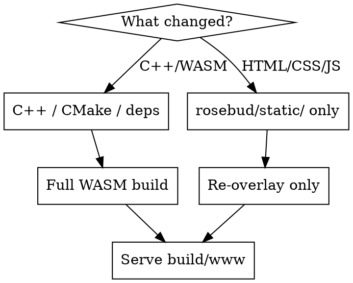

# OpenRCT2-Web Verification

## Build Before Verify

Visual changes must be tested against the full game, not standalone HTML. Always ensure `build/www/` has the latest overlay before serving.



### Re-overlay (fast — for rosebud/static/ changes only)

```bash
cp -r rosebud/static/* build/www/
```

Requires a previous `build/www/` from a prior WASM build. If `build/www/` doesn't exist, do a full build first.

### Full WASM build (slow — for C++/CMake/dependency changes)

```bash
rosebud/docker-build
```

This automatically overlays `rosebud/static/` at the end.

## Serve Command

Always use the project server — never bare `python3 -m http.server`:

```bash
python3 rosebud/serve.py --host 0.0.0.0 --port 8000
```

Default directory is `build/www/`. Sets required COOP/COEP/CORP headers for SharedArrayBuffer.

## By Change Type

| Change type | Build step | Then |
|-------------|------------|------|
| **Loading overlay / UI** | Re-overlay | Serve, Playwright screenshot, test JS API |
| **index.js wiring** | `node --check rosebud/static/index.js` + re-overlay | Serve and verify in browser |
| **C++ / WASM** | Full build via `rosebud/docker-build` | Serve `build/www/` |
| **Asset packaging** | Full build | Verify all three zips load |

## Scope Your Claims

- **Overlay-only test**: State "overlay renders correctly; full game load not tested (requires WASM build)"
- **Full build test**: State "game loads end-to-end through loading screen"
- Never say "all checks pass" when only testing a subset

## Visual Verification

For any CSS/HTML/UI change: `playwright-capture` then `visual-judge`. Code review alone is not verification.
